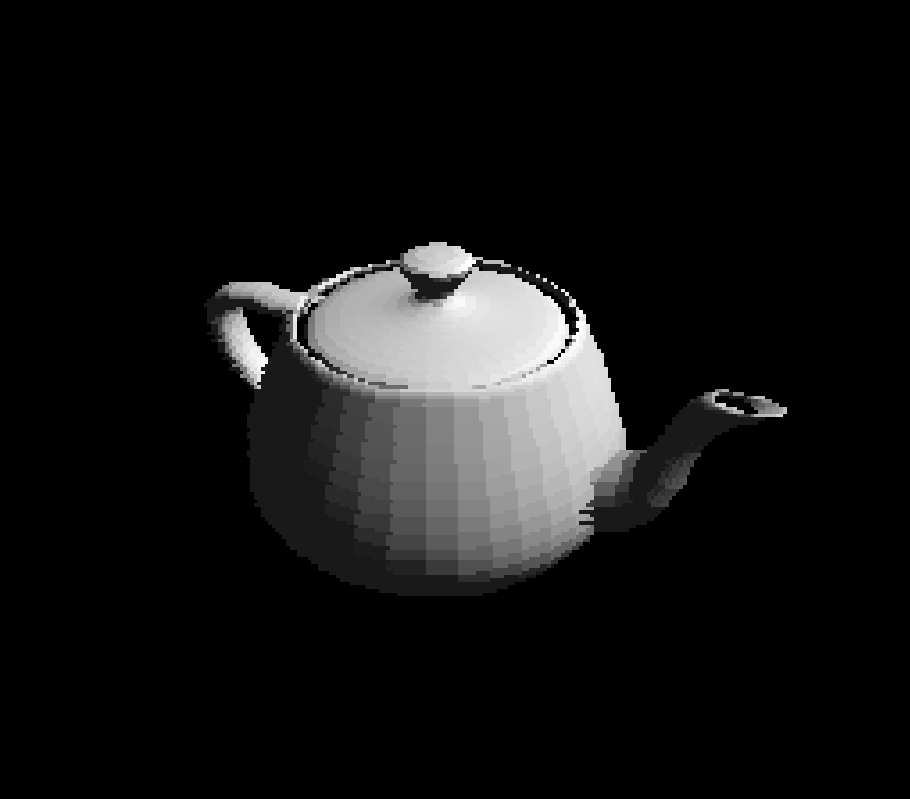

# PS1-Style 3D Engine

A C++ implementation of a PlayStation 1-style 3D engine that recreates the distinctive visual style of PS1 games, including texture quantization, dithering, and affine texture mapping.



## Features

- 3D rendering with PS1-style visual effects
- Texture mapping with quantization and dithering
- Depth buffer for proper 3D rendering
- Support for OBJ model loading
- Camera system with perspective projection
- AABB (Axis-Aligned Bounding Box) culling
- Basic lighting system
- Debug visualization (FPS counter, triangle count)
- SIMD optimizations for depth buffer clearing

## Technical Details

### Rendering Features
- Affine texture mapping (characteristic PS1-style texture warping)
- Texture quantization during loading
- Floyd-Steinberg dithering
- Depth buffer for proper 3D rendering
- Triangle sorting for transparency
- Fog effect for distance-based color blending

### Performance Optimizations
- SIMD instructions for depth buffer operations
- AABB culling to reduce unnecessary triangle processing
- Efficient triangle clipping against view frustum
- Optimized texture sampling

### Graphics Pipeline
1. Model loading and transformation
2. View frustum culling using AABB
3. Triangle transformation and lighting
4. Perspective projection
5. Triangle clipping
6. Rasterization with texture mapping
7. Dithering (optional)
8. Final frame composition

## Dependencies

- SFML (Simple and Fast Multimedia Library)
- C++17 or later
- CMake (version 3.10 or later)
- A C++ compiler that supports C++17 (e.g., GCC, Clang, MSVC)
- SIMD support (SSE instructions)

## Building

1.  **Clone the repository**

2.  **Create a build directory:**
    ```bash
    mkdir build
    cd build
    ```

3.  **Configure the project using CMake:**
    ```bash
    cmake ..
    ```
    *   You can specify the build type (e.g., Debug or Release) using `-DCMAKE_BUILD_TYPE`:
        ```bash
        cmake .. -DCMAKE_BUILD_TYPE=Release  # For an optimized build (default)
        cmake .. -DCMAKE_BUILD_TYPE=Debug    # For a debug build
        ```

4.  **Build the project:**
    *   **Using Make (Linux/macOS):**
        ```bash
        make
        ```
    *   **Using MSBuild (Windows, if Visual Studio generators were used):**
        Open the `.sln` file in Visual Studio and build, or use the command line:
        ```bash
        msbuild PS1Engine.sln /property:Configuration=Release 
        # Replace PS1Engine.sln with the actual solution file name if different.
        # The configuration (Release/Debug) should match what you used with cmake.
        ```
    *   **Using CMake's generic build command (cross-platform):**
        This is often the simplest way to build after configuring.
        ```bash
        cmake --build . --config Release # Or --config Debug
        ```

5.  **Run the executable:**
    The executable `PS1Engine` (or `PS1Engine.exe` on Windows) will be located in the `build` directory (or a subdirectory like `build/Release` or `build/Debug` depending on the generator and configuration).
    ```bash
    ./PS1Engine  # On Linux/macOS
    # or
    # Release\PS1Engine.exe # On Windows, if built in Release mode in a subdirectory
    ```

## Usage

```cpp
// Initialize engine
Engine* engine = new Engine(60, 4, "PS1 Engine Demo");

// Load textures
engine->LoadTexture("texture.png");

// Load 3D models
engine->components.createFromFile("model.obj", textureID);

// Main loop
while (engine->isOpen()) {
    engine->checkEvents();
    engine->calculateTriangles(camera->pos, camera->vTarget, camera->vUp);
    engine->renderAll();
}
```

## Configuration Options

- `targetFPS`: Target frames per second
- `scale`: Window scaling factor
- `useDither`: Enable/disable dithering
- `useSort`: Enable/disable triangle sorting

## Todo List

- [x] Texture metadata (width, height, data, dithered, size)
- [x] 2D arrays for pixels, update render only once per frame
- [x] AABB boxes
- [ ] Point lights
- [ ] Gouraud shading
- [ ] Use fixed point numbers
- [ ] Store triangle normals
- [ ] Shared resources

## Contributing

Feel free to submit issues and pull requests.

## License

This project is licensed under the MIT License - see the [LICENSE](LICENSE) file for details. 
